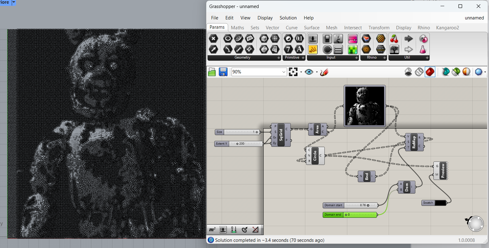

# Blog post #19

## Esercitazione Rhino e Grasshopper

Ho convertito un'immagine in bianco e nero in una serie di cerchi di diverse dimensioni e densità, che ricreano l'immagine originale, come visto a lezione. 
Non ho utilizzato il file della lezione, ho cercato di replicare il procedimento a memoria e cercando su internet.

Ancora non mi è perfettamente chiaro come funzionano tutti i parametri (come ad esempio, il raggio dei cerchi, come cambia la dimensione della griglia).

Non so se sarei capace di produrre un tutorial.

[Progetto Grasshopper (.gh)](assets/esercitazione_1.gh){: .back-button download="" }

<!-- BACK_BUTTON_START -->

<a href="../../" class="back-button">Torna indietro</a>

<!-- BACK_BUTTON_END -->
