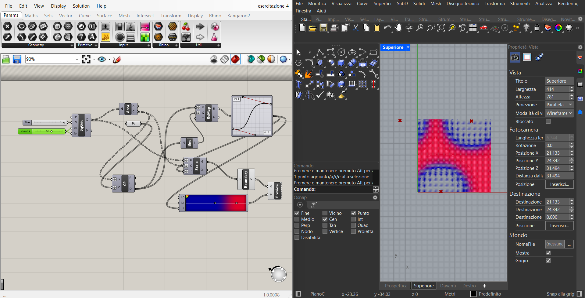

# Blog post #21

## Esercitazione sui Pattern con Grasshopper

Ho creato un sistema parametrico basato sulla teoria dei campi. Ho utilizzato un punto attrattore per influenzare una griglia regolare. La transizione tra la geometria originale e quella deformata non è lineare, ma controllata da una curva di rimappatura (Graph Mapper), che mi permette di ricreare l'effetto di distorsione ottica tipico della __Op Art di Vasarely__.
Non ho potuto spingermi oltre a causa delle limitazioni del mio PC.

[Progetto Grasshopper (.gh)](assets/esercitazione_4.gh){: .back-button download="" }

<!-- BACK_BUTTON_START -->

<a href="../../" class="back-button">Torna indietro</a>

<!-- BACK_BUTTON_END -->
