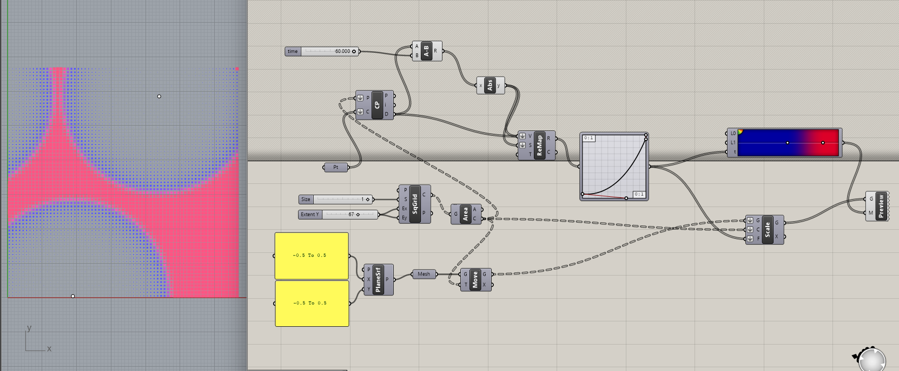

# Blog post #23

## Effetto Ripple su un pannello con patter a quadretti

Ho ripreso il pattern che ho realizzato in GH e provato ad allegerire il carico in quantyo il mio PC faticava a reggerlo. Ho aggiunto uno slider che ora permette di regolare l'intensità dell'effetto magnetico dei punti, come se fossero gocce d'acqua che cadono e provocano onde in una pozza. Vorrei un risultato diverso ma non riesco a capire come ottenerlo, in quanto il progetto rallenta parecchio il PC.

[Progetto Rhino (.3dm)](assets/pattern_ripple.3dm){: .back-button download="" }
[Progetto Grasshopper (.gh)](assets/pattern_ripple.gh){: .back-button download="" }

<!-- BACK_BUTTON_START -->

<a href="../../" class="back-button">Torna indietro</a>

<!-- BACK_BUTTON_END -->
