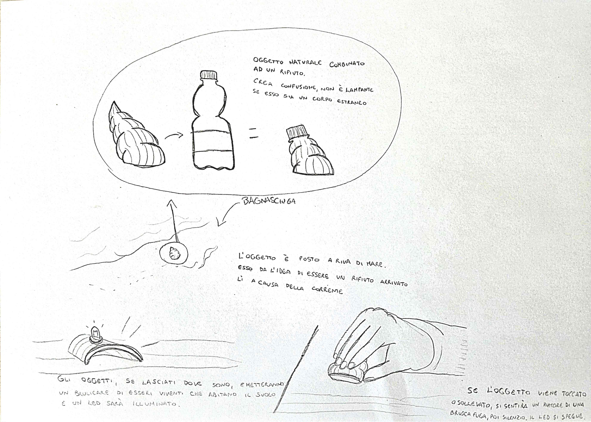

# Blog post #16

## Documentazione Abstract prima lezione

### Le intenzioni
Progettare un sistema interattivo legato al mare e l'azione antropologica su di esso, discretizzando il sistema per creare un sunto preliminare di ciò che voglio realizzare.

### Simbiosi tra organico e inorganico

Quest'opera esplora il bagnasciuga non come luogo incontaminato, ma come ecosistema ibrido dove i rifiuti plastici diventano casa per la microfauna marina, come ad esempio crostacei e molluschi. 
L'installazione fonde il materiale organico (alghe, gusci e conchiglie) con quello inorganico (plastica e metallo) per creare un'opera che mette in difficoltà il fruitore:
Essi sono rifiuti o parte della natura?

### La Rabbit Hole

Gli elementi di attrazione saranno il lieve bagliore pulsante prodotto da un LED posto sopra o all'interno dell'oggetto e da un sommesso brulicare sonoro (suoni di piccoli movimenti, fruscii, chele sche scattano ecc.) che invitano lo spettatore ad avvicinarsi e a scoprire cosa abiti quegli oggetti.

### L'interazione con l'utente

Se il fruitore tocca o solleva l'oggetto, attraverso un sensore di prossimità o di vibrazione, esso si agiterà leggermente emettendo un rumore (come se, qualcosa al suo interno fosse scappato o si fosse spaventato, ritirandosi) per poi diventare completamente silezioso; a sua volta, anche il LED si spegnerà, come se l'oggetto ora fosse inanimato.
Il fruitore, da paladino della natura che vuole ripulire la battigia, si trasforma in un elemento di disturbo, provando un senso di colpa. 
Ciò evidenzia la fragilità di un ecosistema malato, che cerca di adattarsi alla presenza di elementi estranei e dannosi.

<!-- BACK_BUTTON_START -->

<a href="../../" class="back-button">Torna indietro</a>

<!-- BACK_BUTTON_END -->
