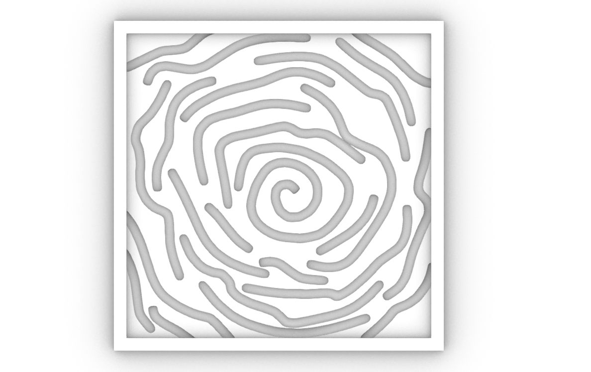
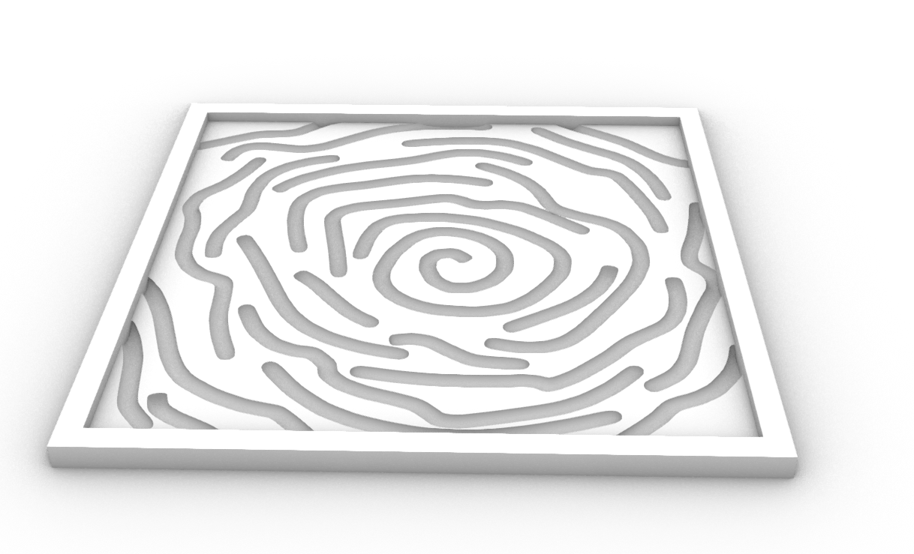
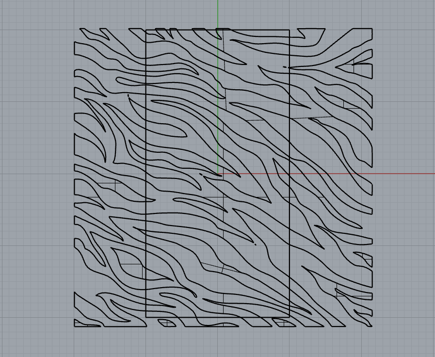
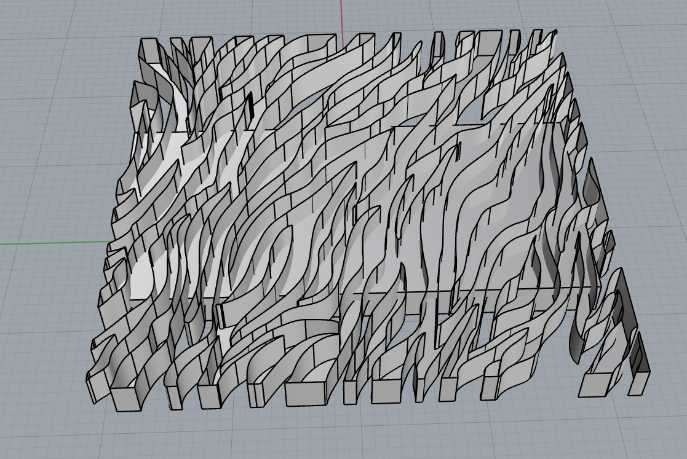

# Blog post #22

## Esercitazione con Pannello pattern

Ho realizzato 2 pannelli con sopra diversi pattern.
Il primo è il pattern dei petali di una rosa vista dall'alto, su un pannello con cornice quadrato.

[Progetto Rhino (.3dm)](assets/pannello_pattern_1.3dm){: .back-button download="" }

Il secondo pannello doveva avere un pattern zebrato, ma ho avuto dei problemi:
Dopo aver realizzato le superfici piane, le ho estruse verso l'alto, ma la parte superiore risultava cava. Ho successivamente provato a usare la differenza booleana su un pannello rettangolare, ma falliva.

[Progetto Rhino (.3dm)](assets/pannello_pattern_2.3dm){: .back-button download="" }

<!-- BACK_BUTTON_START -->

<a href="../../" class="back-button">Torna indietro</a>

<!-- BACK_BUTTON_END -->
