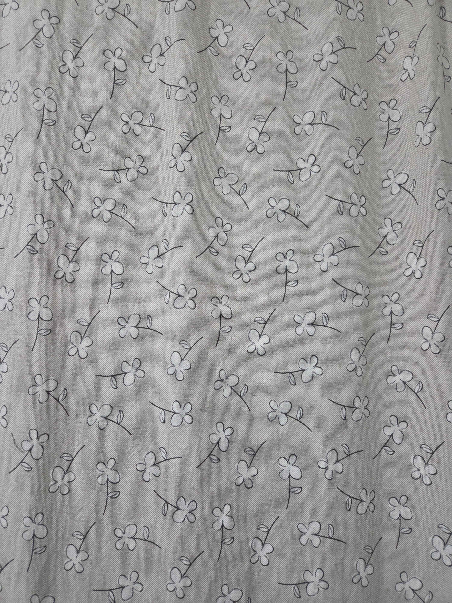
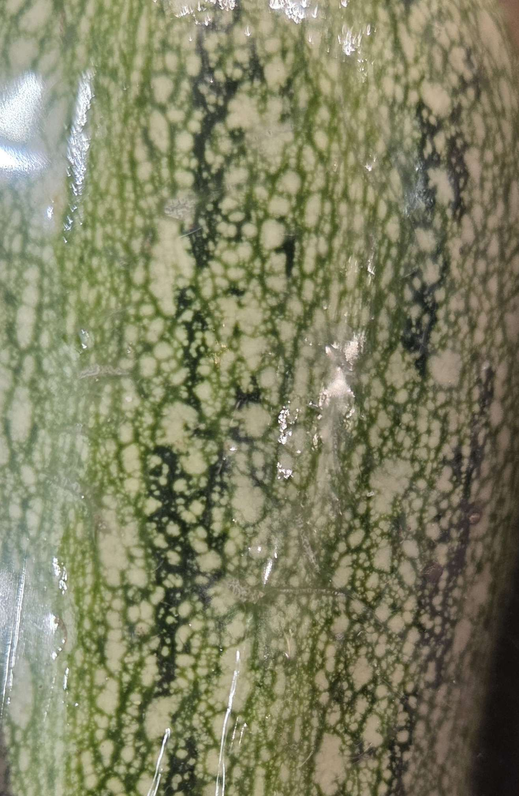
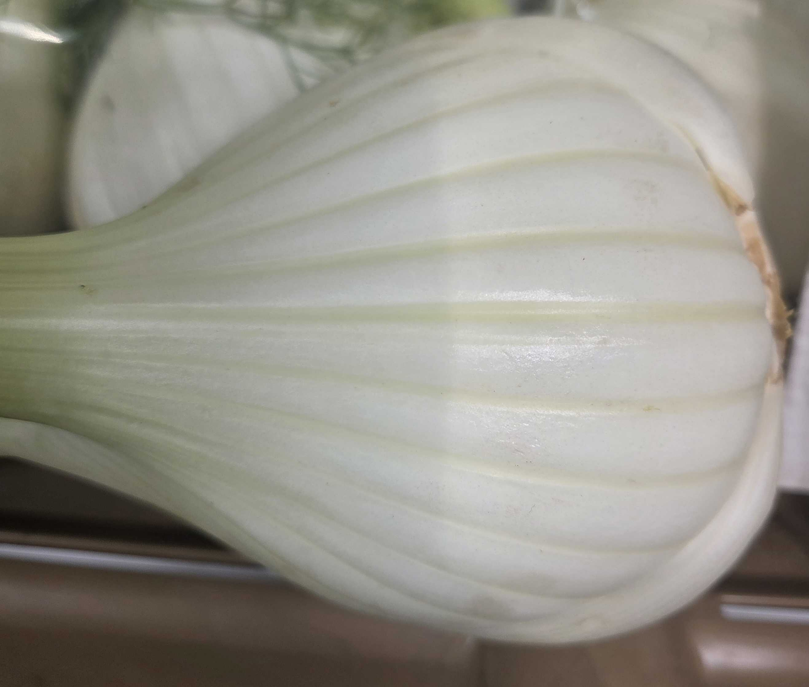
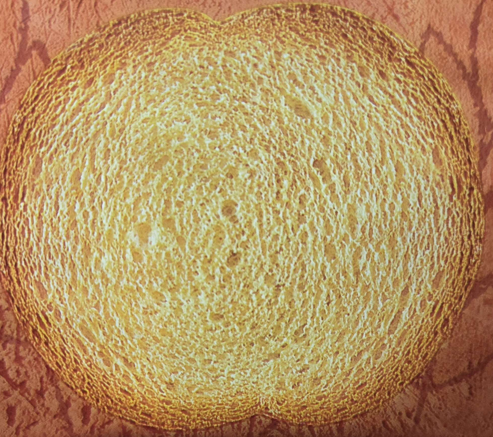
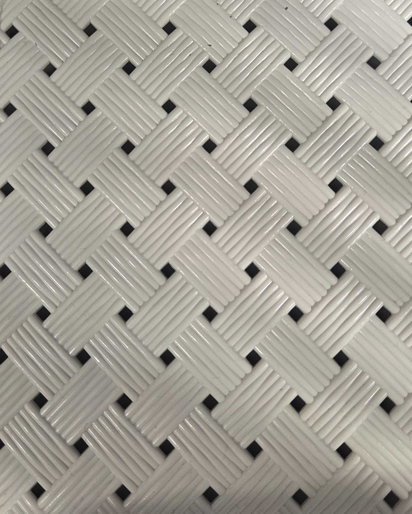
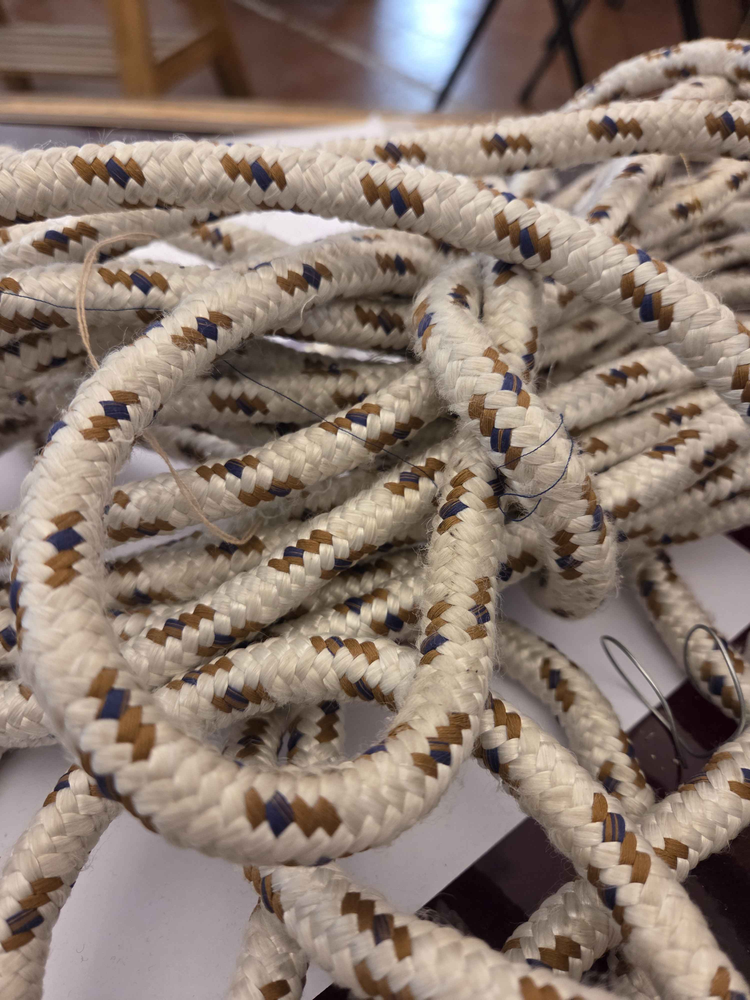

# Blog post #17

## Raccolta Pattern

# Pattern a fiori di una tenda
Pattern artificiale decorativo

# Pattern di una zucchina
Pattern naturale irregolare ma coerente

# Pattern di un finocchio
Pattern naturale lineare

# Pattern alveolatura di una fetta biscottata
Pattern chimico-fisico di lievitazione irregolare

# Pattern di un cesto
Pattern geometrico di intreccio

# Pattern di una corda
Pattern a sequenza di fibre intrecciate

<!-- BACK_BUTTON_START -->

<a href="../../" class="back-button">Torna indietro</a>

<!-- BACK_BUTTON_END -->
